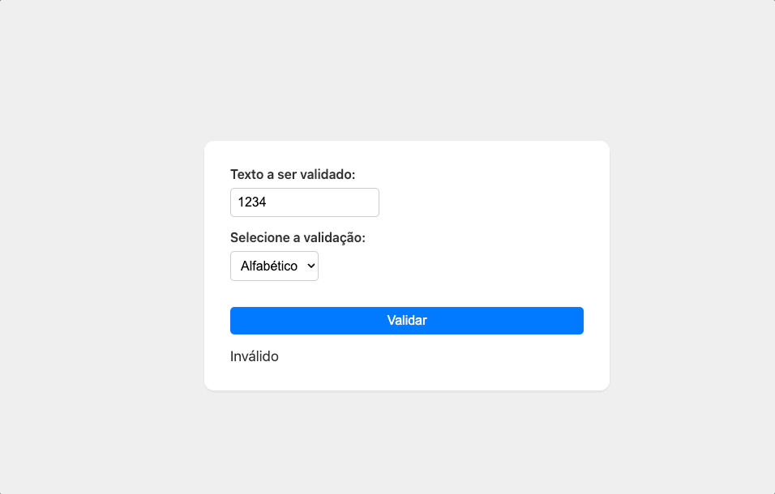

# Validador de Campos

Este projeto demonstra um aplicativo simples de validação de campos usando a biblioteca `validator.js`. A aplicação possui uma interface amigável e permite ao usuário validar diferentes tipos de dados inserindo-os em um campo de texto e selecionando o tipo de validação desejado.

  

## Funcionalidades

- Interface simples e fácil de usar
- Utiliza a biblioteca `validator.js` para validar os dados inseridos
- Suporta cinco tipos de validação:
  - E-mail
  - URL
  - Numérico
  - Alfabético
  - Telefone móvel
- Exibe o resultado da validação em tempo real
- Design inspirado na Apple e responsivo

## Habilidades aplicadas

- HTML5
- CSS3
- JavaScript
- Uso da biblioteca `validator.js`
- Criação e configuração de um projeto npm
- Configuração do Vite para desenvolvimento e compilação